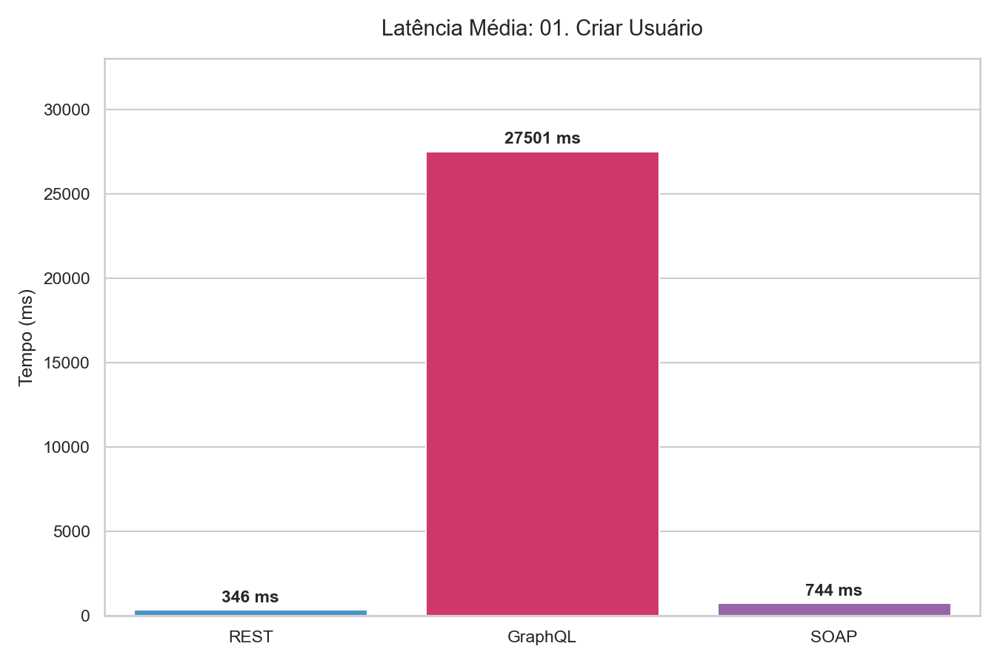
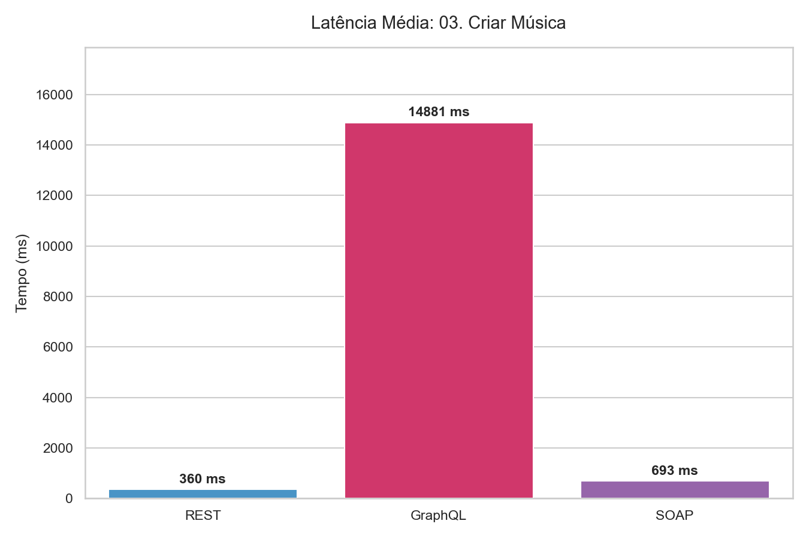
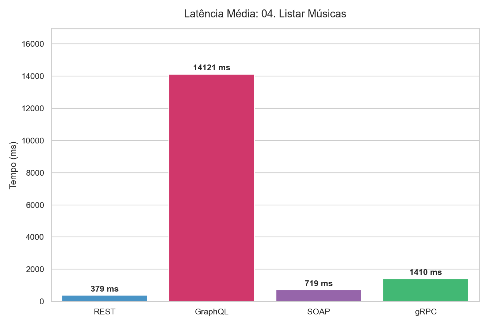
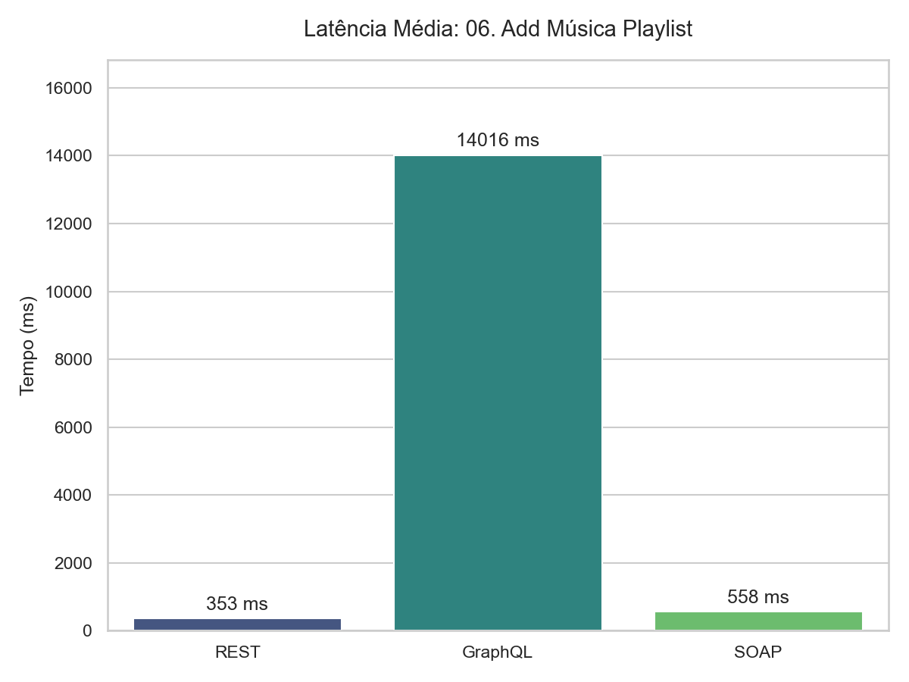
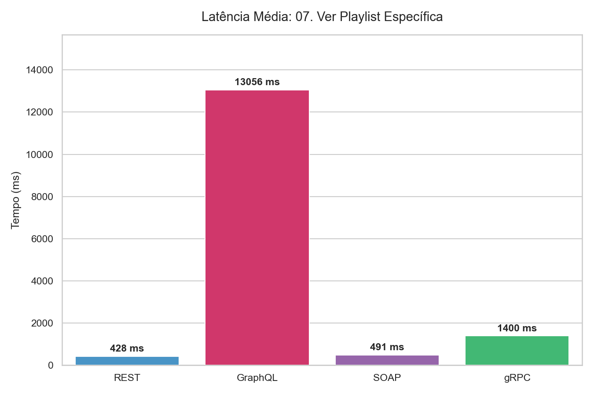
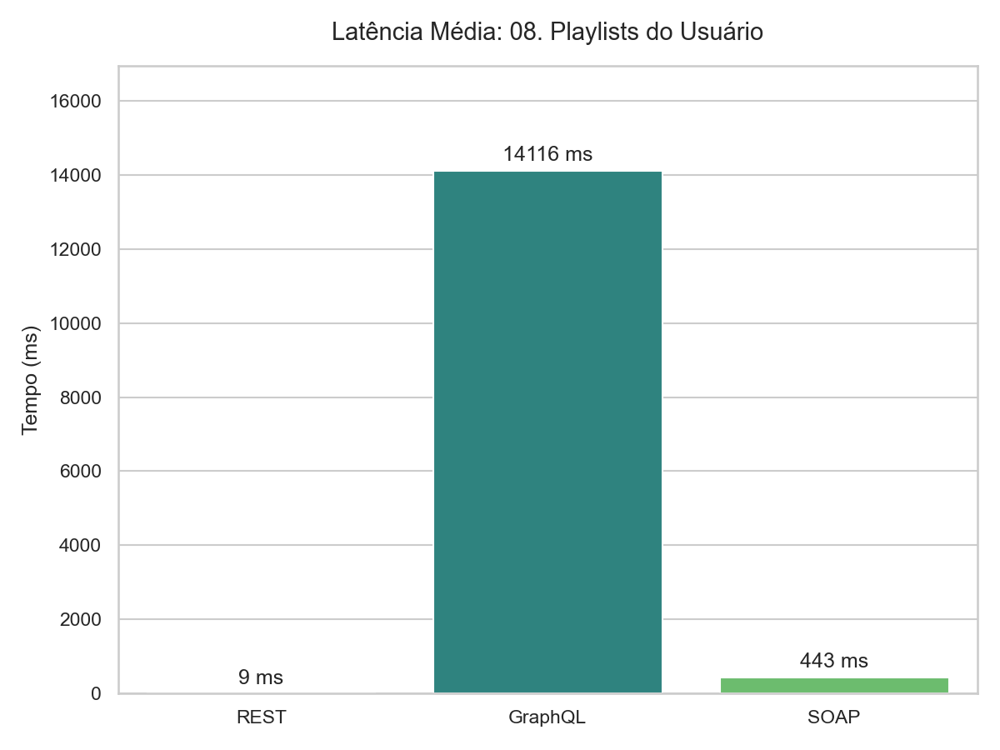
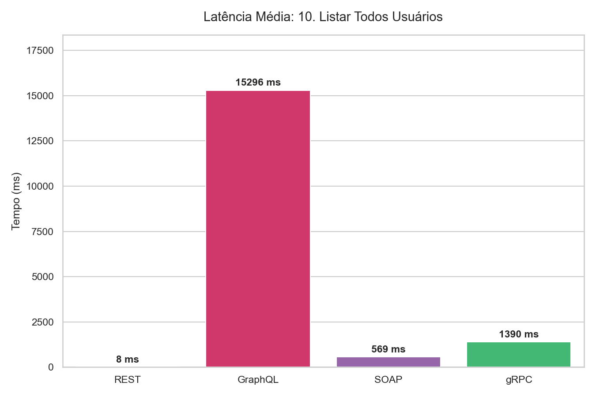

# Evolução das APIs: Investigando SOAP, REST, GraphQL e gRPC

**Disciplina:** Computação Distribuída
**Professor(a):** Naboa das Chargas Mendonça

**Integrantes do Grupo:**
* Rafael Silva - Matrícula: 2212378
* Siwan Eden - Matrícula: 2220191
* Evandro Luz - Matrícula: 2220294

---

## 1. Introdução e Visão Geral

Este projeto tem como objetivo explorar, implementar e analisar comparativamente quatro das tecnologias mais influentes no cenário de desenvolvimento de APIs e comunicação entre sistemas distribuídos: **SOAP, REST, GraphQL e gRPC**.

Embora todas compartilhem o objetivo central de permitir a troca de informações de forma organizada, eficiente e segura entre aplicações heterogêneas, cada uma aborda esse desafio com filosofias arquiteturais, protocolos e casos de uso distintos. A compreensão profunda dessas diferenças é crucial para a tomada de decisão na engenharia de software moderna.

A seguir, apresentamos a fundamentação teórica que alicerça o desenvolvimento prática deste projeto, detalhando a origem, o funcionamento e os "trade-offs" (vantagens e limitações) de cada tecnologia.

---

## 2. Fundamentação Teórica

### 2.1. SOAP (Simple Object Access Protocol)

O SOAP surgiu no início dos anos 2000, fruto de um esforço conjunto de gigantes como Microsoft e IBM. Ele nasceu para resolver o complexo problema da interoperabilidade em um cenário de TI fragmentado, oferecendo um protocolo padronizado e robusto para que sistemas desenvolvidos em diferentes linguagens e plataformas pudessem se comunicar de forma confiável. É a base dos tradicionais *Web Services*.

#### Características Principais
* **Protocolo Baseado em XML:** Utiliza exclusivamente XML para estruturar o envelope, o cabeçalho e o corpo de todas as mensagens, garantindo um formato universal, embora verboso.
* **Independência de Transporte:** Embora o HTTP seja o mais comum, o SOAP pode operar sobre outros protocolos como SMTP (e-mail), TCP e JMS.
* **Contrato Rígido (WSDL):** A comunicação é baseada em um contrato fortemente tipado definido pelo WSDL (Web Services Description Language), que dita exatamente como os serviços devem ser consumidos.
* **Padrões WS-\* (WS-Star):** Suporta um vasto conjunto de extensões padronizadas para requisitos corporativos complexos, como **WS-Security** (segurança avançada), **WS-AtomicTransaction** (transações distribuídas) e WS-ReliableMessaging.

#### Análise de Trade-offs

| Vantagens (Prós) | Desvantagens (Contras) |
| :--- | :--- |
| **Alta Padronização:** O contrato rígido garante consistência e facilita a integração entre sistemas legados e muito diferentes. | **Complexidade:** A curva de aprendizado e a implementação são significativamente mais altas do que em alternativas modernas. |
| **Segurança Robusta:** Suporte nativo e padronizado para criptografia e assinaturas digitais via WS-Security, ideal para cenários bancários e governamentais. | **Verbosidade e Desempenho:** As mensagens XML são grandes e pesadas, consumindo mais banda e processamento (parsing lento). |
| **Confiabilidade Enterprise:** Excelente suporte para operações críticas que exigem tratamento de erros estruturado e transações ACID distribuídas. | **Inflexibilidade:** Menos adequado para o desenvolvimento ágil e sistemas modernos (web/mobile) que exigem comunicação leve. |

---

### 2.2. REST (Representational State Transfer)

Definido por Roy Fielding em sua tese de doutorado em 2000, o REST não é um protocolo, mas um **estilo arquitetural**. Inspirado na própria estrutura da World Wide Web, o REST surgiu como uma resposta à complexidade do SOAP, propondo um modelo mais simples, escalável e eficiente para sistemas distribuídos, aproveitando ao máximo a infraestrutura do protocolo HTTP existente.

#### Características Principais
* **Foco em Recursos:** Tudo é um "recurso" (ex: Usuário, Pedido) acessado via URLs (Endpoints) claras e padronizadas (ex: `/usuarios/123`).
* **Uso Semântico do HTTP:** Utiliza os verbos HTTP para definir a ação a ser realizada: `GET` (ler), `POST` (criar), `PUT/PATCH` (atualizar), `DELETE` (remover).
* **Stateless (Sem Estado):** Cada requisição do cliente para o servidor deve conter todas as informações necessárias para ser processada. O servidor não armazena o contexto da sessão do cliente.
* **Formato Flexível (JSON):** Embora possa usar XML, o padrão de mercado tornou-se o JSON (JavaScript Object Notation), que é leve e nativamente suportado por navegadores e linguagens modernas.

#### Análise de Trade-offs

| Vantagens (Prós) | Desvantagens (Contras) |
| :--- | :--- |
| **Simplicidade e Adoção:** Fácil de entender, implementar e consumir. É o padrão dominante da indústria para APIs públicas e web. | **Overfetching e Underfetching:** É comum endpoints retornarem dados demais (overfetching) ou de menos (underfetching), exigindo múltiplas requisições para montar uma tela. |
| **Alto Desempenho:** Mensagens JSON leves e comunicação rápida, ideal para aplicações web e mobile. | **Falta de Padrão Rígido:** Por ser um estilo, e não um protocolo estrito, diferentes equipes podem implementar APIs REST de formas inconsistentes (ex: na padronização de erros). |
| **Escalabilidade:** A arquitetura *stateless* facilita muito a escalabilidade horizontal dos servidores. | **Recursos Complexos:** Modelar relacionamentos complexos entre dados pode resultar em uma teia de endpoints difíceis de gerenciar. |

---

### 2.3. GraphQL

O GraphQL foi desenvolvido pelo Facebook em 2012 e aberto à comunidade em 2015. Ele nasceu da necessidade de otimizar o carregamento de dados em aplicações mobile complexas (como o feed de notícias do Facebook), onde a abordagem REST tradicional gerava gargalos de desempenho devido ao excesso de requisições e tráfego de dados desnecessários.

#### Características Principais
* **Linguagem de Consulta:** GraphQL não é um estilo arquitetural, mas uma linguagem de consulta (query language) para APIs e um runtime para executar essas consultas.
* **Orientado ao Cliente (Client-Driven):** Inverte o controle do REST. O cliente especifica exatamente quais campos de dados deseja receber, eliminando o *overfetching* e o *underfetching*.
* **Endpoint Único:** Ao contrário do REST que possui múltiplos endpoints, o GraphQL expõe geralmente apenas um endpoint (ex: `/graphql`) que recebe todas as consultas.
* **Schema Fortemente Tipado:** O servidor define um Schema estrito de todos os tipos de dados, queries (buscas), mutations (alterações) e subscriptions (tempo real) disponíveis, servindo como documentação automática.

#### Análise de Trade-offs

| Vantagens (Prós) | Desvantagens (Contras) |
| :--- | :--- |
| **Eficiência na Transferência:** O cliente recebe apenas o que pediu, economizando banda, crucial para dispositivos móveis. | **Complexidade no Servidor:** A implementação no backend é mais complexa, exigindo resolvers eficientes para montar os dados dinamicamente sem sobrecarregar o banco de dados (problema N+1). |
| **Flexibilidade no Frontend:** Desenvolvedores frontend têm autonomia para iterar nas telas sem depender de mudanças constantes no backend. | **Cache HTTP Difícil:** Por usar um único endpoint (geralmente via POST), perde-se os mecanismos de cache nativos do HTTP que o REST aproveita bem. |
| **Agregação de Dados:** Permite buscar dados de múltiplos recursos relacionados em uma única requisição de rede. | **Risco de Queries Abusivas:** Se não houver controle (como limites de profundidade), clientes podem fazer consultas aninhadas muito pesadas que derrubam o servidor. |

---

### 2.4. gRPC (Google Remote Procedure Call)

Lançado pelo Google em 2015, o gRPC é um framework de RPC (Remote Procedure Call) moderno e de **altíssima performance**. Ele evoluiu de uma tecnologia interna do Google (Stubby) projetada para lidar com a comunicação massiva entre milhares de microsserviços com a menor latência possível.

#### Características Principais
* **Protocolo Binário (Protobuf):** Utiliza *Protocol Buffers* como linguagem de definição de interface (IDL) e formato de serialização. É binário, compacto e muito mais rápido para serializar/deserializar que JSON ou XML.
* **Baseado em HTTP/2:** Tira proveito dos recursos avançados do HTTP/2, como multiplexação (várias requisições na mesma conexão TCP) e compressão de cabeçalhos.
* **Comunicação Bidirecional e Streaming:** Suporta nativamente streaming de dados do cliente para o servidor, do servidor para o cliente, ou bidirecional em tempo real.
* **Geração de Código ("Stubby"):** A partir do arquivo `.proto` (o contrato), gera-se automaticamente o código do cliente (stub) e do servidor em diversas linguagens, garantindo forte tipagem.

#### Análise de Trade-offs

| Vantagens (Prós) | Desvantagens (Contras) |
| :--- | :--- |
| **Performance Extrema:** Latência muito baixa e mensagens compactas. É o padrão-ouro para comunicação "leste-oeste" (entre microsserviços internos). | **Dificuldade de Debug:** Como o formato é binário, não é legível por humanos. Requer ferramentas específicas para inspecionar o tráfego, diferentemente do JSON no REST. |
| **Streaming Nativo:** Excelente para cenários de dados contínuos, IoT, chats ou feeds em tempo real. | **Suporte Limitado em Browsers:** Não é suportado nativamente por navegadores web padrão. Requer proxies (como gRPC-Web) para ser usado no frontend. |
| **Contrato Rigoroso e Tipagem:** O uso de Protobuf previne muitos erros de integração entre serviços escritos em linguagens diferentes. | **Curva de Aprendizado:** A implementação e o ferramental são mais complexos para iniciantes se comparado ao ecossistema REST/JSON. |

---
## 3. Estrutura do Projeto

O repositório principal `STREAMING-DE-MUSICA` atua como um *monorepo*, contendo as implementações de backend separadas por linguagem. Abaixo, detalhamos a estrutura da pasta **`python-api/`**, onde reside o servidor híbrido.

```text
STREAMING-DE-MUSICA/
│
├── 📂 javascript-api/          # Implementação secundária (Node.js)
│
└── 📂 python-api/              # Implementação Principal (Servidor Híbrido)
    │
    ├── 📜 main.py              # [ORQUESTRADOR] Inicializa os servidores HTTP e gRPC via AsyncIO.
    ├── 📜 database.py          # [CONEXÃO] Cliente Singleton do Supabase.
    ├── 📜 streaming.proto      # [CONTRATO] Definição binária para o gRPC.
    ├── 📜 requirements.txt     # Dependências do projeto.
    ├── ⚙️ .env                 # Variáveis de ambiente (URL e Key do Banco).
    │
    ├── 📂 services/            # [NÚCLEO - Business Logic]
    │   │   # Aqui reside a lógica pura, reutilizada por todos os protocolos.
    │   ├── auth_service.py     # Regras de Login/Cadastro
    │   ├── music_service.py    # Regras de Músicas
    │   └── playlist_service.py # Regras de Playlists
    │
    ├── 📂 routers/             # [ADAPTADORES - Interface Layer]
    │   │   # Cada arquivo aqui "traduz" um protocolo para os Services.
    │   ├── auth_router.py      # Endpoints REST (Auth)
    │   ├── music_router.py     # Endpoints REST (Músicas)
    │   ├── playlist_router.py  # Endpoints REST (Playlists)
    │   ├── graphql_router.py   # Configuração do Strawberry (GraphQL)
    │   ├── grpc_servicer.py    # Implementação do Servidor gRPC
    │   └── soap_service.py     # Definição do Serviço e Models SOAP (Spyne)
    │
    ├── 📂 schemas/             # [MODELAGEM DE DADOS]
    │   ├── 📂 REST/            # Models Pydantic (validação JSON)
    │   ├── 📂 GRAPHQL/         # Types e Inputs do Strawberry
    │   └── 📂 GRPC/            # Arquivos _pb2.py gerados pelo compilador Protobuf
    │
    └── 📂 supabase/            # [MIGRAÇÕES]
        └── 📂 migrations/      # Scripts SQL para versionamento do banco de dados.

```

# **COLOCAR AQUI DO JAVASCRIPT**

## 4. Arquitetura da Solução

O projeto foi arquitetado utilizando dois backends distintos (**Python** e **JavaScript**) que operam sobre uma única fonte de verdade: o **Supabase**.

### 4.1. Infraestrutura de Dados (Supabase)
Utilizamos o Supabase (PostgreSQL) para centralizar os dados. A conexão é feita via variáveis de ambiente, garantindo segurança.

O banco de dados foi estruturado no Supabase utilizando **PostgreSQL**. Abaixo, o script SQL utilizado para criar as tabelas e definir as políticas de segurança (Row Level Security - RLS).

A tabela `usuario` possui uma chave estrangeira ligada diretamente à tabela interna de autenticação do Supabase (`auth.users`), garantindo integridade entre o login e os dados do perfil.

```sql
-- 1. Tabela de Usuários (Vinculada ao Auth do Supabase)
create table public.usuario (
  id uuid references auth.users on delete cascade not null primary key,
  nome text,
  idade int
);

-- Habilitar RLS e criar política de acesso para Usuários
alter table public.usuario enable row level security;

create policy "Liberar Leitura e Escrita de Usuarios" 
on public.usuario 
for all 
using (true) 
with check (true);

-- 2. Tabela de Músicas
create table public.musica (
  id bigint generated by default as identity primary key, 
  nome text not null,    
  artista text not null   
);

alter table public.musica enable row level security;

create policy "Liberar Musicas" 
on public.musica 
for all 
using (true) 
with check (true);

-- 3. Tabela de Playlists
create table public.playlist(
    id bigint generated by default as identity primary key, 
    nome text not null,
    usuario_id uuid references public.usuario(id) on delete cascade not null
);

alter table public.playlist enable row level security;

create policy "Liberar Playlists" 
on public.playlist 
for all 
using (true) 
with check (true);

-- 4. Tabela Pivô (Relacionamento N:N entre Playlist e Música)
create table public.playlist_musica (
  id bigint generated by default as identity primary key,
  
  playlist_id bigint references public.playlist(id) on delete cascade not null,
  
  musica_id bigint references public.musica(id) on delete cascade not null,
  
  -- Garante que a mesma música não seja adicionada duas vezes na mesma playlist
  unique(playlist_id, musica_id)
);

alter table public.playlist_musica enable row level security;

create policy "Liberar Juncao Playlist_Musica" 
on public.playlist_musica 
for all 
using (true) 
with check (true);

```

### 4.2. Implementação A: Backend Python

A escolha das bibliotecas foi estratégica para garantir compatibilidade entre protocolos modernos (como gRPC) e legados (como SOAP) no mesmo ambiente. O **FastAPI** atua como o orquestrador principal devido ao seu suporte nativo a `asyncio`.

| Componente | Biblioteca | Versão/Justificativa |
| :--- | :--- | :--- |
| **Linguagem** | `Python 3.10` | Versão escolhida para garantir estabilidade com a biblioteca `spyne`. |
| **Orquestrador** | `FastAPI` | Framework principal que gerencia o ciclo de vida da aplicação. |
| **Servidor Web** | `Uvicorn` | Servidor ASGI para as rotas HTTP (REST, GraphQL, SOAP). |
| **Banco de Dados** | `supabase` | Cliente oficial para PostgreSQL na nuvem. |
| **GraphQL** | `strawberry-graphql` | Definição de Schemas baseada em classes Python. |
| **gRPC** | `grpcio` | Implementação oficial do Google para RPC. |
| **SOAP** | `spyne` + `a2wsgi` | `spyne` define o serviço e `a2wsgi` permite rodá-lo dentro do FastAPI. |

**Dependências principais (`requirements.txt`):**
```text
fastapi>=0.100.0
uvicorn[standard]>=0.24.0
python-dotenv>=1.0.0
supabase>=2.0
strawberry-graphql>=0.200.0
grpcio>=1.59.0
grpcio-tools>=1.59.0
spyne>=2.14.0
lxml>=4.9.0
a2wsgi>=1.10.0
requests>=2.31.0

```
**Instalar as dependências:**
```powershell
pip install -r requirements.txt
```

**Rodar o código:**
```powershell
.\venv\Scripts\activate
python main.py
```

### 4.3. Implementação B: Backend Javascript

## 5. Análise Crítica e Comparativa

Com base na experiência de desenvolvimento da equipe e nos resultados obtidos durante a implementação do serviço de streaming de músicas, compilamos uma análise crítica abordando a curva de aprendizado, a complexidade de implementação e o desempenho de cada tecnologia.

### 5.1. Classificação de Complexidade de Implementação em Python

Abaixo, as tecnologias foram ordenadas da **mais simples para a mais complexa**, considerando o tempo de configuração do ambiente, a facilidade de depuração (debug) e a quantidade de código necessária (boilerplate).

1.  **REST (Mais Simples):** A implementação utilizando FastAPI demonstrou ser a mais fluida. A integração nativa com Pydantic para validação de dados e a geração automática da documentação Swagger tornaram o desenvolvimento intuitivo e rápido. Foi a tecnologia que exigiu menos configurações adicionais.

2.  **GraphQL:** O uso da biblioteca Strawberry facilitou a definição dos Schemas baseados em classes Python. A complexidade foi ligeiramente superior ao REST devido à necessidade de compreender a lógica de Resolvers e a modelagem das Queries, mas a flexibilidade proporcionada ao cliente compensou o esforço de configuração.

3.  **SOAP:** A implementação apresentou dificuldades significativas. A principal barreira foi a compatibilidade da biblioteca Spyne com versões recentes do Python, exigindo o uso específico da versão 3.10 e a configuração de adaptadores WSGI/ASGI. A verbosidade do formato XML e a rigidez do contrato WSDL tornaram o processo de depuração mais lento e cansativo em comparação aos anteriores.

4.  **gRPC (Mais Complexo):** Representou a maior curva de aprendizado técnica. A necessidade de definir contratos em arquivos `.proto` separados, a etapa de compilação para gerar código Python e a configuração de um servidor rodando sobre HTTP/2 com dados binários adicionaram camadas de complexidade inexistentes nos outros protocolos. O teste também se mostrou mais difícil devido à ilegibilidade dos dados trafegados sem ferramentas específicas.

### 5.2. Classificação de Complexidade de Implementação em Javascript

### 5.3. Resultados dos Testes de Carga (Python)

Para validar empiricamente as diferenças de desempenho entre os protocolos, realizamos testes de carga utilizando as ferramentas **Locust** (para REST, GraphQL e SOAP) e **ghz** (para gRPC).

O cenário de teste simulou **50 usuários simultâneos** realizando operações de leitura e escrita (criar usuários, listar músicas, consultar playlists...) durante um período de 30 segundos.











---